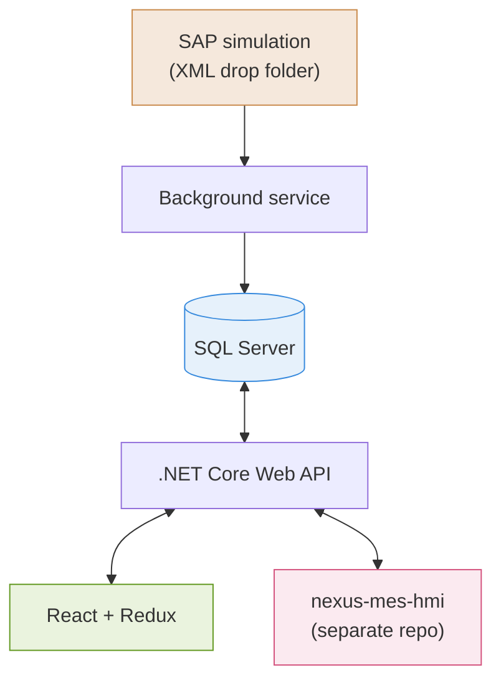
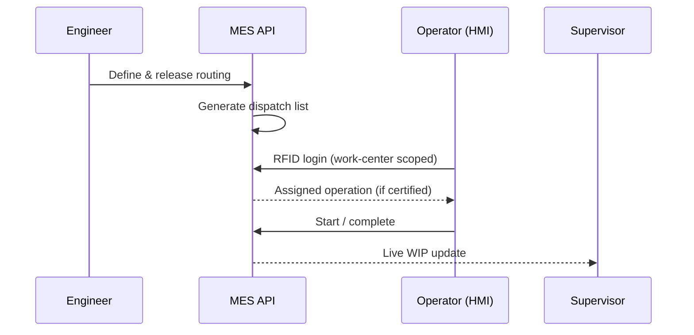

# nexus-mes-platform

Full-stack MES simulating ISA-95 production workflows — SAP-style integration to real-time shop floor tracking.

Backend + React dashboards for planning and execution. The operator HMI lives in a separate repo: [`nexus-mes-hmi`](https://github.com/Toqa-Ashraf8/nexus-mes-hmi.git).

## Architecture



## Data flow



## Scope

Built end-to-end:
- SAP integration simulation (`FileSystemWatcher` + XML)
- Process Definition & Routing (draft → approve → release, versioned)
- Dispatch List
- Live WIP Tracking
- Work-center-scoped operator certification checks

Later phase: Quality inspection, Reporting/analytics.

## Stack

.NET Core Web API · EF Core (Repository pattern) · SQL Server · React + Redux Toolkit

## Notable decisions

- **File-based SAP integration** — mirrors real plants without live ERP API access; handles file locking, idempotency, error recovery.
- **Routing versioning** — work orders reference the exact released version (engineering change management).
- **Work-center-scoped dispatch** — operators see only their station's task, never the full schedule.

## Run

```bash
cd src/Api && dotnet ef database update && dotnet run
cd src/client && npm install && npm run dev
```
